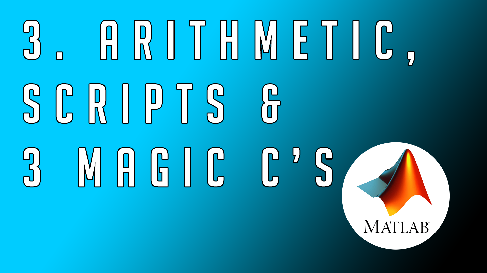
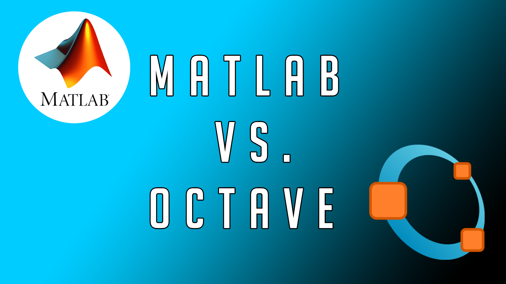
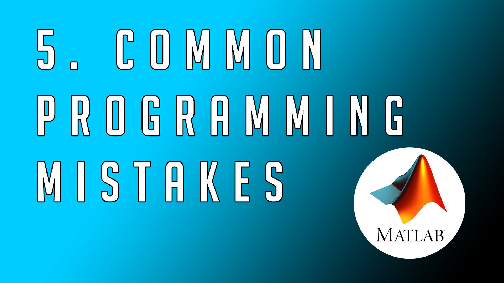
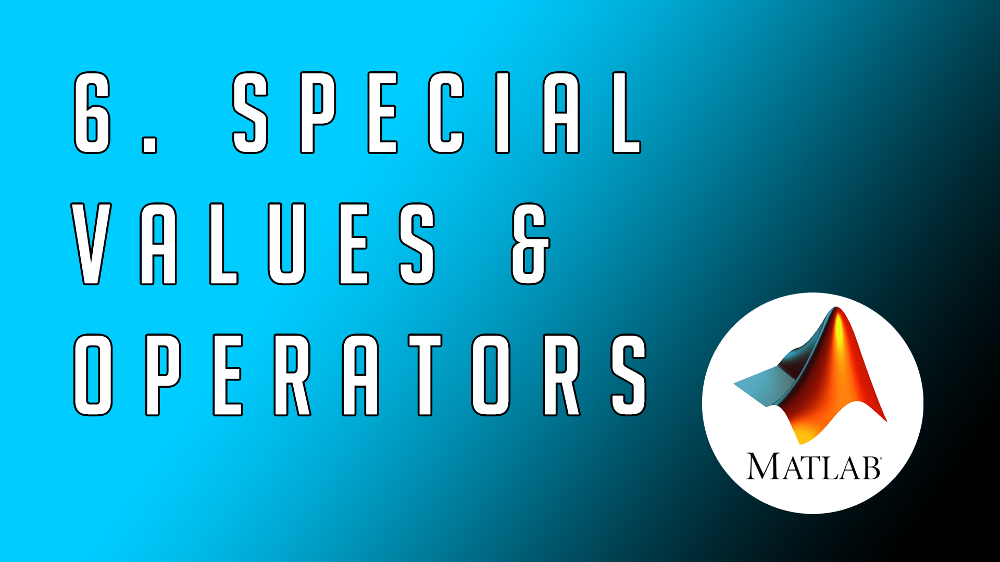
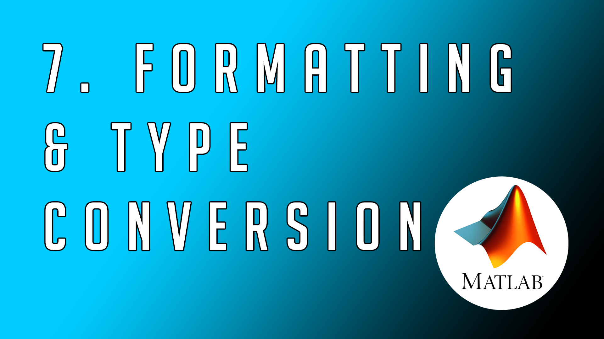
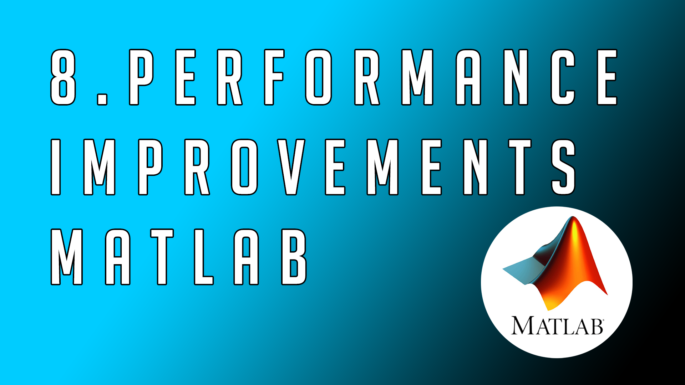
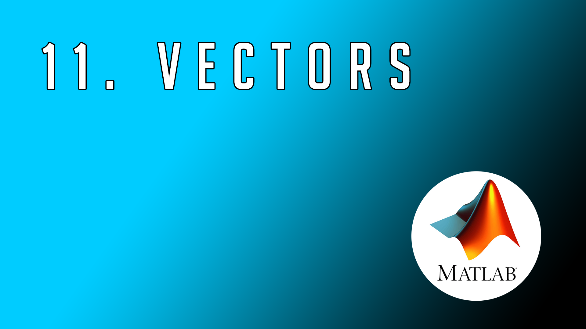
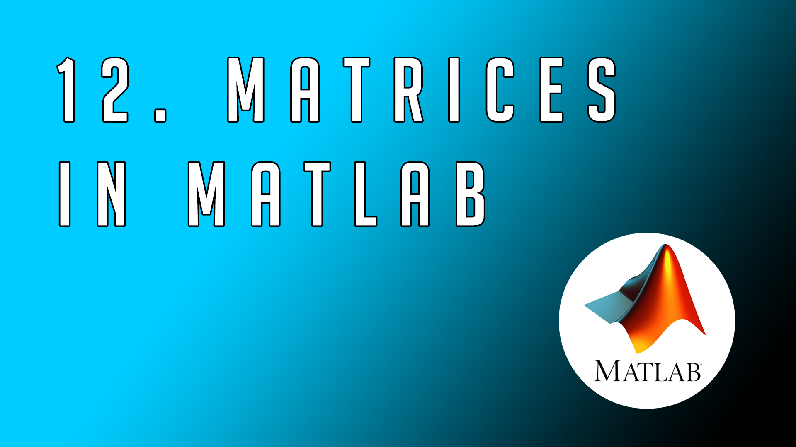
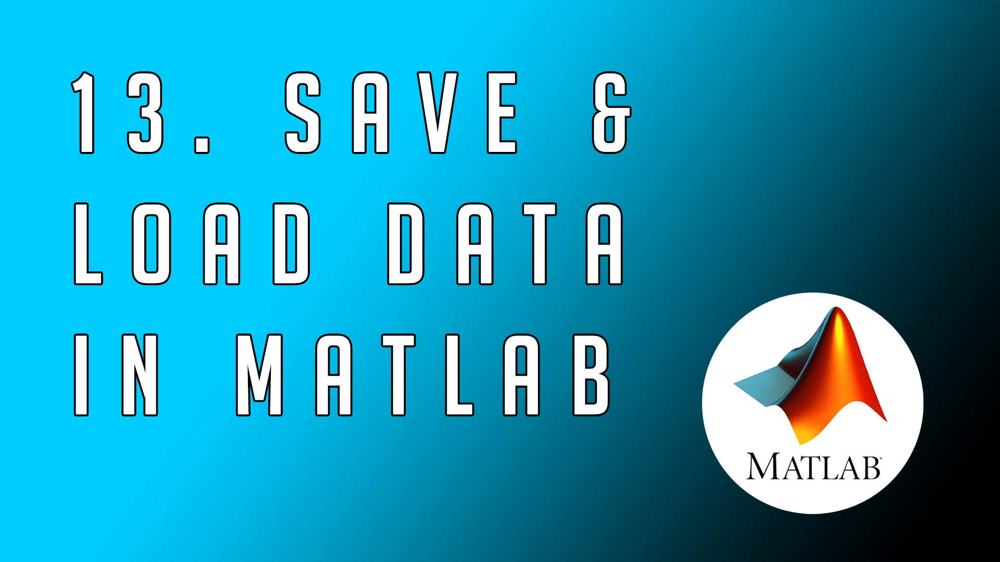
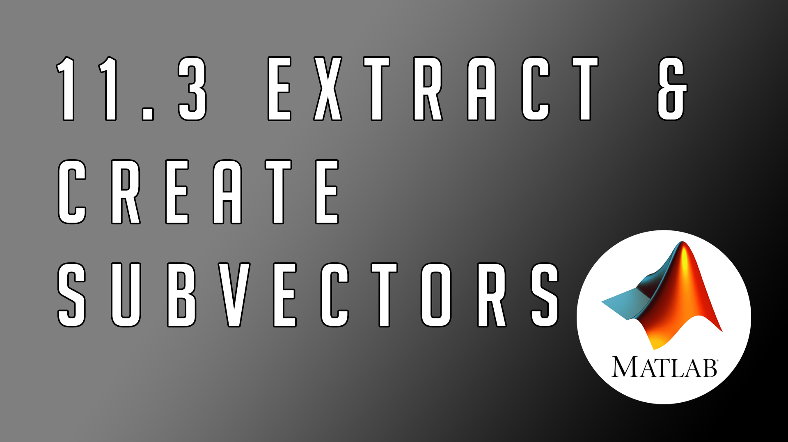

MATLAB - From Zero to Hero
================

> This repository is for people starting with their **MATLAB** journey or want to solidify existing knowledge.
> It is my goal to make the tutorials as easy as possible no matter how complex the topic is! 
> If you have any specific wishes you can contact me via my social media channels - preferably Instagram where I am most active on. 
> The pictures act as hyperlinks to the videos or corresponding documents.

 

🎥 - **Early video access on my [Patreon Page](https://www.patreon.com/theengiineer)**

<table width="100%">
    <tr>
        <td width="50%">
            <H2>Matlab - Introduction</H2>
            In this repository you will find all the homework exercises and other relevant material. A mega course for those
            who want to learn programming with MATLAB, with plenty of examples, theoretical concepts, tricks and best practices.
        <td width="50%"></td>
    </tr>
</table>
 

<table width="100%">
    <tr>
        <td width="50%">
        
        <td width="50%"><H2>Matlab - Cheat Sheet</H2>
            Feel free to print out this cheat sheet to  use it in your classes and share it with your friends to spread the love for MATLAB & simulation. </td>
    </tr>
</table>
 

All Episodes
================

<table width="100%">
    <tr>
        <td width="50%"><a href="https://www.youtube.com/watch?v=KAKkrgCBlBw"></td>
        <td width="50%">
            

                     <a href="https://www.youtube.com/watch?v=KAKkrgCBlBw">video </a> |
                     <a href="https://github.com/jousefm/Mega-Course-MATLAB/blob/master/Slides/1.%20Introduction.pdf">slides</a>
                     
The first video is a short introduction to MATLAB and its history. We will have a look on how to create a MathWorks account, how to install MATLAB and how to use all the 
                     resources from this course. Duration: 14 minutes
</td>
    </tr>
    <tr>
        <td width="50%">

                                          <a href="https://www.youtube.com/watch?v=QhtFpSu-QRI">video</a> |
                                          <a href="https://github.com/jousefm/Mega-Course-MATLAB/blob/master/Homework/Homework1.pdf">homework</a>
                                          
In this video we will have a look at MATLAB's graphical user interface (GUI), the workspace and several other options that the interface offers to us. We will talk a little bit about the Help functionalities
                                          as well as the documentation of MATLAB. Duration: 12 minutes
</td>
        <td width="50%"><a href="https://www.youtube.com/watch?v=QhtFpSu-QRI"></td>
    </tr>
        <tr>
        <td width="50%"><a href="https://www.youtube.com/watch?v=adRli4J9egI"></td>
        <td width="50%">
            

                     <a href="https://www.youtube.com/watch?v=adRli4J9egI">video</a> |
                     <a href="https://github.com/jousefm/Mega-Course-MATLAB/blob/master/Homework/Homework2.pdf">homework</a> |
                     <a href="https://github.com/jousefm/Mega-Course-MATLAB/blob/master/Code/ThirdVideo.m">code</a>  

                     
In the third video we are dealing with MATLAB as an intelligent calculator, its basic syntax & the Three Magic C's! We will learn how to comment/uncomment existing code and save your
                            precious work in a so called script. Additionally we will briefly talk about the datatypes our variables have. Duration: 17 minutes
</td>
    </tr>
    <tr>
        <td width="50%">

                                          <a href="https://www.youtube.com/watch?v=Ak3fgkmQA-M">video</a> |
                                          <a href="https://github.com/jousefm/Mega-Course-MATLAB/blob/master/Slides/2.%20MATLABvsOctave.pdf">slides</a>
                                          
In this video we will compare MATLAB with its free counterpart GNU Octave and have a look at the differences but also features that both have in common. Duration: 20 minutes
</td>
        <td width="50%"><a href="https://www.youtube.com/watch?v=Ak3fgkmQA-M"></td>
    </tr>
       </tr>
        <tr>
        <td width="50%"><a href="https://www.youtube.com/watch?v=qSIf9iHvKZU"></td>
        <td width="50%">
            

                     <a href="https://www.youtube.com/watch?v=qSIf9iHvKZU">video</a> |
                     <a href="https://www.youtube.com/user/TheEngiineer/">homework (coming soon)</a> |
                     <a href="https://github.com/jousefm/Mega-Course-MATLAB/blob/master/Code/average.m">function used</a> |
                     <a href="https://github.com/jousefm/Mega-Course-MATLAB/blob/master/Code/FifthVideo.m">code </a>  

                     
In this video we will have a look at the most common programming mistakes and how to avoid them. Duration: 19 minutes
</td>
    </tr>
        <tr>
        <td width="50%">

                                          <a href="https://www.youtube.com/watch?v=BayULSWvlIg">video</a> |
                                          <a href="https://www.youtube.com/user/TheEngiineer/">homework (coming soon)</a> |
                                          <a href="https://www.patreon.com/posts/matlab-special-29802756">code </a>  

                                          
This video will discuss special values like Pi as well as the Euler's number e, cover real and complex as well as NaN values. There is also a quick intro to logical operators, trigonometric functions as well as 
                                          the exponential and logarithmic function. A small intro to bracketing will also be covered. Duration: 20 minutes
</td>
        <td width="50%"><a href="https://www.patreon.com/posts/matlab-special-29802756"></td>
    </tr>
       </tr>
       </tr>
        <tr>
        <td width="50%"><a href="https://www.patreon.com/theengiineer"></td>
        <td width="50%">
            

                     <a href="https://www.youtube.com/watch?v=PAQVxl7HS5g">video</a> |
                     <a href="https://www.patreon.com/theengiineer">homework (coming soon)</a> |
                     <a href="https://github.com/jousefm/Mega-Course-MATLAB/blob/master/Code/SeventhVideo.m">code </a>  

                     
This video will cover the most common data types, where to find all the data types from MATLAB and how to work with formatting. Duration: 11 minutes
</td>
    </tr>
        </tr>
        <tr>
        <td width="50%">

                                          <a href="https://youtu.be/Y_jmKE5IhSY">video</a> |
                                          <a href="https://www.patreon.com/theengiineer">homework (coming soon)</a> |
                                          <a href="https://github.com/jousefm/Mega-Course-MATLAB/blob/master/Slides/8.%20MATLABPerformance.pdf">slides</a> |
                                          <a href="https://github.com/jousefm/Mega-Course-MATLAB/blob/master/Code/EighthVideo.m">code </a>  

                                          
This video will discuss what the pros and cons of MATLAB are and how you can measure the performance of your code. We will compare different code by using the tic/toc command and
                                          using bar plots for visualization. The MATLAB profiler will briefly be introduced to show how hot spots can be identified inside the code. Duration: 10 minutes
</td>
        <td width="50%"><a href="https://www.patreon.com/theengiineer"></td>
    </tr>
        </tr>
       </tr>
       </tr>
        <tr>
        <td width="50%"><a href="https://www.patreon.com/theengiineer"></td>
        <td width="50%">
            

                     <a href="https://youtu.be/o-aPiE7GDlg">video </a> |
                     <a href="https://www.patreon.com/theengiineer">homework (coming soon)</a> |
                     <a href="https://github.com/jousefm/Mega-Course-MATLAB/blob/master/Code/NinthVideo.m">code </a>  

                     
This video will briefly discuss the abs and sign functions and how to quickly determine the root of a polynomials, determine the coefficients and concatenate functions. Duration: 7 minutes
</td>
    </tr>
       </tr>
        </tr>
        <tr>
        <td width="50%">

                                          <a href="https://www.youtube.com/watch?v=c99o2-LzUHs">video </a> |
                                          <a href="https://www.patreon.com/theengiineer">homework (coming soon)</a> |
                                          <a href="https://github.com/jousefm/Mega-Course-MATLAB/blob/master/Code/TenthVideo.m">code </a>  

                                          
This video will deal with naming conventions inside of MATLAB and show you how to meet the common standard when it comes to defining variables, parameters and other relevant
                                                 quantities. Duration: 6 minutes
</td>
        <td width="50%"><a href="https://www.patreon.com/theengiineer"></td>
    </tr>
    </tr>
        </tr>
       </tr>
       </tr>
        <tr>
        <td width="50%"><a href="https://www.youtube.com/watch?v=_GNf9GIIIr4"></td>
        <td width="50%">
            

                     <a href="https://www.youtube.com/watch?v=_GNf9GIIIr4">video </a> |
                     <a href="https://www.patreon.com/theengiineer">homework (coming soon)</a> |
                     <a href="https://github.com/jousefm/Mega-Course-MATLAB/blob/master/Code/EleventhVideo.m">code </a>  

                     
This video will teach you about vectors and introduce you to the vast options you can use inside of MATLAB. Subvideos include Special Vectors, Indexing, Dimensions, Dot & Cross Product,
                     Concatenating Vectors, Extraction of Vectors, Subvectors and much more! Duration: 8 minutes
</td>
    </tr>
        </tr>
       </tr>
        </tr>
        <tr>
        <td width="50%">

                                          <a href="https://www.patreon.com/theengiineer">video (coming soon)</a> |
                                          <a href="https://www.patreon.com/theengiineer">homework (coming soon)</a> |
                                          <a href="https://www.patreon.com/theengiineer">code (coming soon)</a>  

                                          
This video will teach you about matrices and introduce you to the vast options you can use inside of MATLAB. Topics include Special Matrices, Indexing, Dimensions, Dot & Cross Product,
                                                Concatenating Matrices, Extraction of Matrices, Submatrices and much more! Duration: X minutes
</td>
        <td width="50%"><a href="https://www.patreon.com/theengiineer"></td>
    </tr>
        </tr>
        </tr>
       </tr>
       </tr>
        <tr>
        <td width="50%"><a href="https://www.patreon.com/theengiineer"></td>
        <td width="50%">
            

                     <a href="https://www.patreon.com/theengiineer">video (coming soon)</a> |
                     <a href="https://www.patreon.com/theengiineer">homework (coming soon)</a> |
                     <a href="https://www.patreon.com/theengiineer">code (coming soon)</a>  

                     
In this video we will learn how you can load data into MATLAB and export it into other formats - some additional tips will be given! Duration: X minutes
</td>
    </tr>
        </tr>
        </tr>
       </tr>
        </tr>
        <tr>
        <td width="50%">

                                          <a href="https://www.patreon.com/theengiineer">video (coming soon)</a> |
                                          <a href="https://www.patreon.com/theengiineer">homework (coming soon)</a> |
                                          <a href="https://www.patreon.com/theengiineer">code (coming soon)</a>  

                                          
This video will give you a brief overview of what type of plots exist inside of MATLAB and how you can create your own fancy plots! Duration: X minutes
</td>
        <td width="50%"><a href="https://www.patreon.com/theengiineer"></td>
    </tr>
        </tr>
        </tr>
        </tr>
       </tr>
       </tr>
        <tr>
        <td width="50%"><a href="https://www.patreon.com/theengiineer"></td>
        <td width="50%">
            

                     <a href="https://www.patreon.com/theengiineer">video (coming soon)</a> |
                     <a href="https://www.patreon.com/theengiineer">homework (coming soon)</a> |
                     <a href="https://www.patreon.com/theengiineer">code (coming soon)</a>  

                     
In this video we will learn how you can load data into MATLAB and export it into other formats - some additional tips will be given! Duration: X minutes
</td>
    </tr>
        </tr>
        </tr>
       </tr>
        </tr>
        <tr>
        <td width="50%">

                                          <a href="https://www.patreon.com/theengiineer">video (coming soon)</a> |
                                          <a href="https://www.patreon.com/theengiineer">homework (coming soon)</a> |
                                          <a href="https://www.patreon.com/theengiineer">code (coming soon)</a>  

                                          
This video will give you a brief overview of what type of plots exist inside of MATLAB and how you can create your own fancy plots! Duration: X minutes
</td>
        <td width="50%"><a href="https://www.patreon.com/theengiineer"></td>
    </tr>
    </table>
     

Social Media
================

  