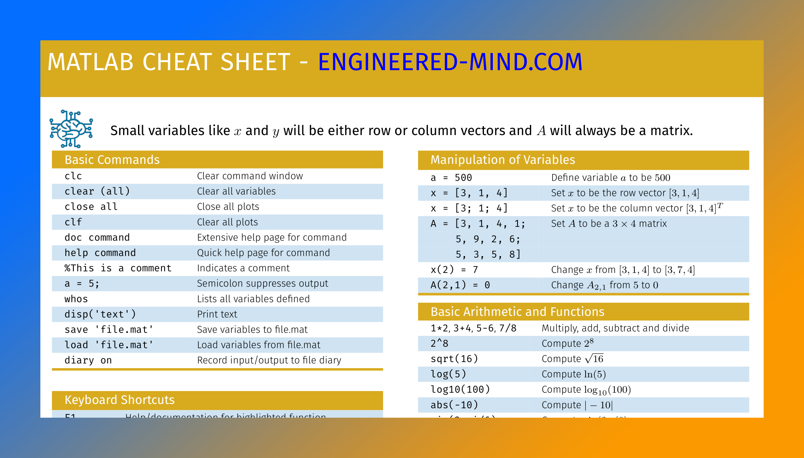
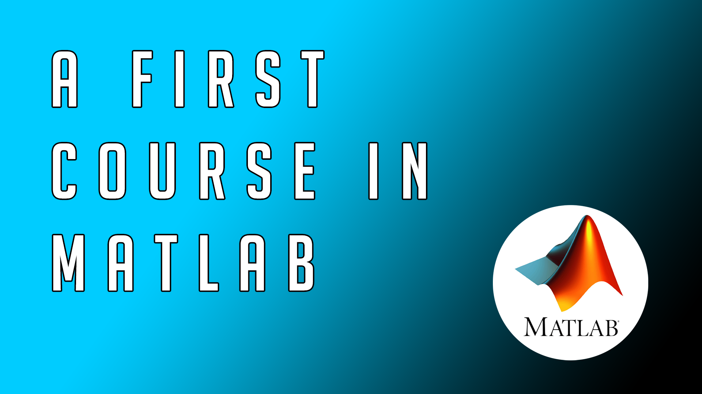
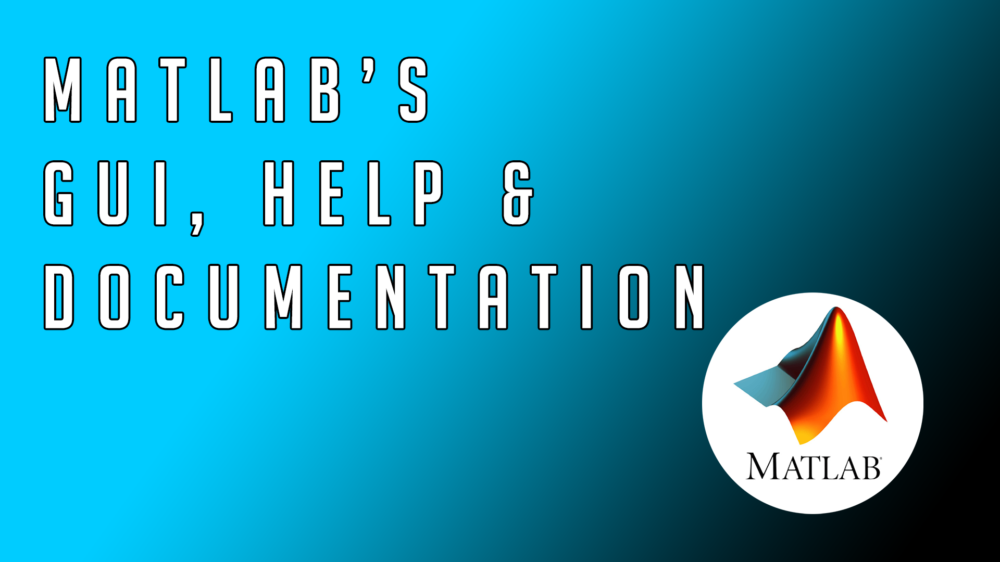

MATLAB - From Zero to Hero
================

> This repository is for people starting with their **MATLAB** journey or want to solidify existing knowledge.
> It is my goal to make the tutorials as easy as possible no matter how complex the topic is! 
> If you have any specific wishes you can contact me via my social media channels - preferably Instagram where I am most active on. 
> The pictures act as hyperlinks to the videos or corresponding documents.

<table width="100%">
    <tr>
        <td width="50%">
            <H2>Matlab - Introduction</H2>
            In this repository you will find all the homework exercises and other relevant material. A mega course for those
            who want to learn programming with MATLAB, with plenty of examples, theoretical concepts, tricks and best practices.
        <td width="50%"></td>
    </tr>
</table>
 

<table width="100%">
    <tr>
        <td width="50%">
        
        <td width="50%"><H2>Matlab - Cheat Sheet</H2>
            Feel free to print out this cheat sheet to  use it in your classes and share it with your friends to spread the love for MATLAB & simulation. </td>
    </tr>
</table>
 

Introduction
================

<table width="100%">
    <tr>
        <td width="50%"><a href="https://www.youtube.com/user/TheEngiineer/"></td>
        <td width="50%">
            

                     <a href="https://www.youtube.com/user/TheEngiineer/">video (coming soon)</a> |
                     <a href="https://github.com/jousefm/Mega-Course-MATLAB/blob/master/Slides/1.%20Introduction.pdf">slides</a> |
                     <a href="https://github.com/jousefm/Mega-Course-MATLAB/blob/master/Homework/Homework1.pdf">homework </a> |
                     <a href="https://www.engineered-mind.com/">code (coming soon)</a>  

                     
The first video covers MATLAB's intelligent calculator feature, basic arithmetic and how to work with code in your beginnings to make sure that commenting code becomes a habit! We will have a look 
                     at MATLAB's data types, special values like the irrational number Pi and the Eulers number e, trigonometric functions and many more interesting features of the MATLAB environment. Duration: X minutes
</td>
    </tr>
    <tr>
        <td width="50%">

                                          <a href="https://www.youtube.com/user/TheEngiineer/">video (coming soon)</a> |
                                          <a href="https://www.youtube.com/user/TheEngiineer/">slides (coming soon)</a> |
                                          <a href="https://www.engineered-mind.com/">code (coming soon)</a>  

                                          
In the second video we are dealing with MATLAB as an intelligent calculator, its basic syntax & the Three Magic C's! We will learn how to comment/uncomment existing code and save your
                                          precious work in a so called script. Additionally we will deal with variables and what datatypes MATLAB offers. Duration: X minutes
</td>
        <td width="50%"></td>
    </tr>
    </table>
     

Social Media
================

Feel free to follow me on **[Twitter](https://twitter.com/Jousefm2)**,  **[Instagram](https://www.instagram.com/jousefmrd/)** & **[GitHub](https://github.com/jousefm)**!